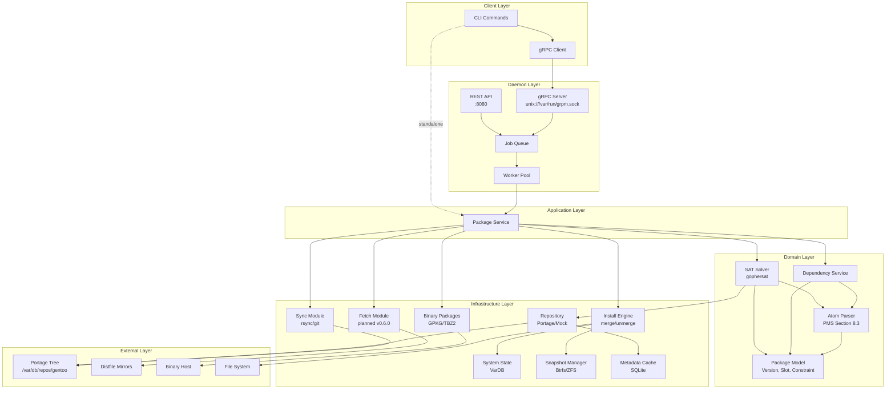

# GRPM Architecture

## System Overview



## Component Descriptions

### Client Layer
- **CLI Commands**: User-facing commands (resolve, install, emerge, sync, etc.)
- **gRPC Client**: Connects to daemon when available, falls back to standalone

### Daemon Layer
- **gRPC Server**: Unix socket server for CLI communication
- **REST API**: HTTP API for external integrations
- **Job Queue**: Prioritized queue with conflict detection
- **Worker Pool**: Parallel job execution

### Application Layer
- **Package Service**: Use case orchestration, coordinates domain and infrastructure

### Domain Layer
- **SAT Solver**: Boolean satisfiability for dependency resolution (gophersat)
- **Package Model**: Core entities (Package, Version, Slot, Constraint)
- **Atom Parser**: PMS-compliant package atom parser (Section 8.3)
- **Dependency Service**: Domain logic for dependency handling

### Infrastructure Layer
- **Repository**: Package metadata abstraction (Portage tree, mock)
- **Sync Module**: Repository synchronization (native rsync, git with GPG)
- **Fetch Module**: Distfile downloading *(planned for v0.6.0)*
- **Install Engine**: Package merge/unmerge operations
- **Binary Packages**: GPKG and TBZ2 format support
- **System State**: Installed package database (VarDB)
- **Snapshot Manager**: Btrfs/ZFS transactional rollback
- **Metadata Cache**: SQLite-backed fast lookups
- **Eclass System**: Dynamic eclass loading via mvdan.cc/sh

### External Systems
- **Portage Tree**: Gentoo package repository
- **Distfile Mirrors**: Source tarball mirrors
- **Binary Host**: Pre-built binary packages
- **File System**: Target system root

---

## Dynamic Eclass Loading (v0.5.2+)

```
Eclass source (bash)
        |
        v
mvdan.cc/sh interpreter
        |
        v
execHandler intercepts commands
        |
        +------------------+------------------+
        |                                     |
        v                                     v
+-------------------+               +-------------------+
| Known commands    |               | Unknown commands  |
| (tc-getCC, use,   |               | (pkg-config,      |
| cmake_*, meson_*) |               | install, ninja)   |
+-------------------+               +-------------------+
        |                                     |
        v                                     v
+-------------------+               +-------------------+
| Go implementations|               | Real shell        |
| (100+ helpers)    |               | execution         |
+-------------------+               +-------------------+
```

### Key Components

- **eclass.Cache** (`internal/eclass/cache.go`): Scans repository eclass/ directories, tracks mtime for invalidation
- **eclass.Executor** (`internal/eclass/executor.go`): Executes eclasses via mvdan.cc/sh bash interpreter
- **eclass.HybridLoader** (`internal/eclass/loader.go`): Dynamic loading with Go fallbacks
- **ebuild.Interpreter** (`internal/ebuild/interpreter.go`): 100+ helper functions mapped to Go implementations

### Command Interception

When an eclass calls a command:
1. **Known commands** (tc-getCC, use, cmake_src_configure, etc.) → Go implementations
2. **Unknown commands** (pkg-config, cmake, ninja, etc.) → Real shell pass-through

This enables most eclasses to work without Go reimplementation.
